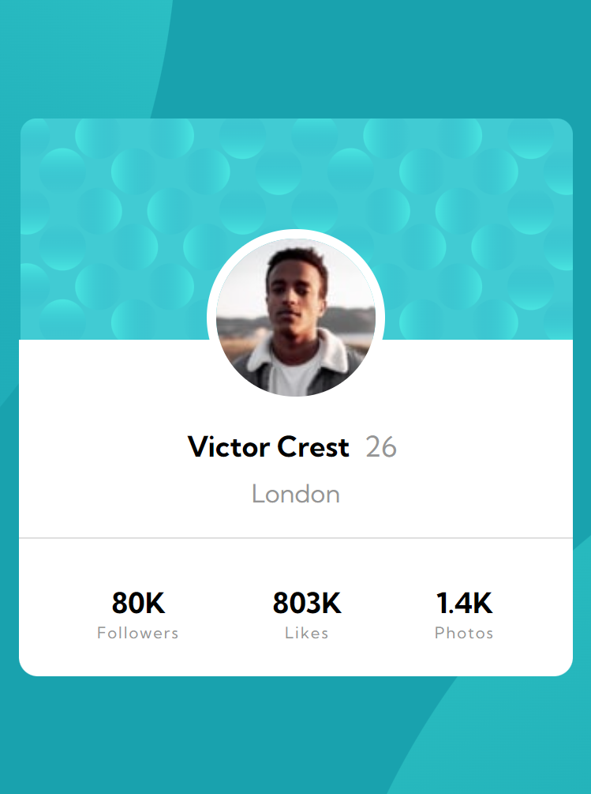

# Frontend Mentor - Profile card component solution

This is a solution to the [Profile card component challenge on Frontend Mentor](https://www.frontendmentor.io/challenges/profile-card-component-cfArpWshJ). Frontend Mentor challenges help you improve your coding skills by building realistic projects. 

## Table of contents

- [Overview](#overview)
  - [The challenge](#the-challenge)
  - [Screenshot](#screenshot)
  - [Links](#links)
- [My process](#my-process)
  - [Built with](#built-with)
  - [Useful resources](#useful-resources)
- [Author](#author)

## Overview

### The challenge

- Build out the project to the designs provided.

### Screenshot

### Links

- Solution URL: [Add solution URL here](https://github.com/code-nick/profile-card-component-main.git)
- Live Site URL: [Add live site URL here](https://your-live-site-url.com)

## My process

### Built with

- Semantic HTML5 markup
- CSS custom properties
- Flexbox
- Mobile-first workflow

### Useful resources

- [@figma](https://www.figma.com) - This helped me for XYZ reason. I really liked this pattern and will use it going forward.

## Author

- Website - [@vicky verma](https://github.com/code-nick)
- Frontend Mentor - [@VickyVerma](https://www.frontendmentor.io/profile/code-nick)

